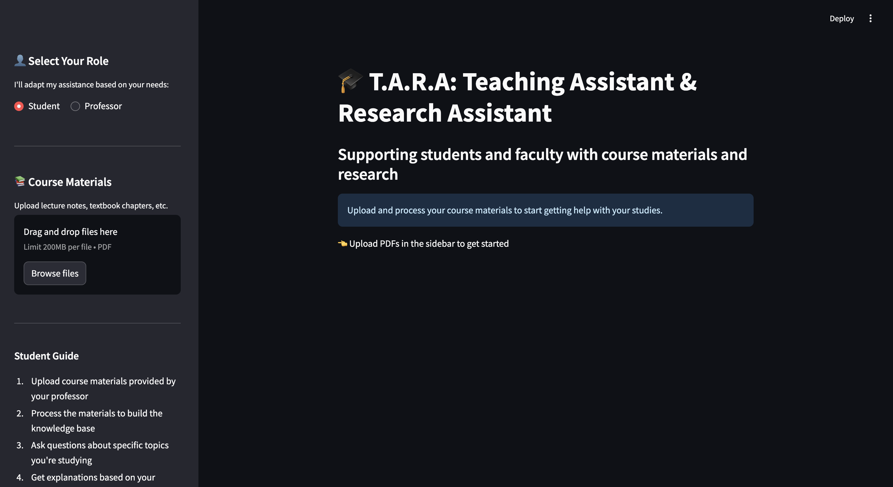

# TARA: Teaching Assistant & Research Aide

TARA is an AI-powered teaching assistant that supports both students and professors by providing contextual responses based on uploaded course materials. Built with Streamlit, LangChain, Ollama, and FAISS, TARA brings adaptive learning support to the classroom.

 <!-- Add a screenshot of your app here -->

## Features

- **Dual Role Support**: Adapts to both student and professor needs with role-specific responses
- **Multiple PDF Processing**: Upload and process multiple documents to build a comprehensive knowledge base
- **Persistent Knowledge**: Knowledge base persists across sessions until manually cleared
- **Real-time Processing**: Clear status indicators while processing documents
- **Contextual Responses**: Generates answers based on the content of uploaded materials
- **Conversational Interface**: Chat-based interaction for natural communication

## How It Works

T.A.R.A uses a Retrieval-Augmented Generation (RAG) system to:

1. Process and embed PDF documents into a vector database (FAISS)
2. Retrieve relevant context when questions are asked
3. Generate responses using Ollama's local LLM (Gemma 3:4b)
4. Tailor responses based on whether the user is a student or professor

## Getting Started

### Prerequisites

- Python 3.10+
- [Ollama](https://ollama.com/) installed and running locally

### Installation

```bash
# Clone the repository
git clone https://github.com/yourusername/tara-teaching-assistant.git
cd tara-teaching-assistant

# Create and activate virtual environment
python -m venv rag_env
source rag_env/bin/activate  # On Windows, use `rag_env\Scripts\activate`

# Install dependencies
pip install -r requirements.txt
```

### Running the App

```bash
streamlit run app.py
```

## Usage

### For Students

1. Select the "Student" role in the sidebar
2. Upload course materials (PDFs)
3. Click "Process these materials" to build the knowledge base
4. Ask questions about the course content
5. Receive explanations tailored for learning

### For Professors

1. Select the "Professor" role in the sidebar
2. Upload course materials and resources
3. Click "Process these materials" to build the knowledge base
4. Ask questions to get teaching insights and content suggestions
5. Receive responses focused on pedagogical approaches

## Project Structure

```
tara-teaching-assistant/
├── app.py                  # Main Streamlit application
├── modules/
│   ├── pdf_processor.py    # PDF processing and vector store creation
│   ├── chat_handler.py     # Chat interface and response generation
├── requirements.txt        # Project dependencies
└── README.md               # This file
```

## Limitations

- Only processes PDF files currently
- Knowledge base is cleared when the Streamlit app restarts
- Performance depends on the local machine's capabilities
- Response quality depends on the selected Ollama model

## Future Improvements

- [ ] Support for more file types (DOCX, TXT, etc.)
- [ ] Add Voice Features
- [ ] Add Calling features
- [ ] Persistent storage for knowledge base across restarts
- [ ] Fine-tuning options for the underlying model
- [ ] Ability to save and export chat history
- [ ] Custom document collection management

## License

[MIT License](LICENSE)

## Acknowledgments

- Built with [Streamlit](https://streamlit.io/)
- Powered by [LangChain](https://github.com/langchain-ai/langchain)
- Uses [Ollama](https://ollama.com/) for local LLM inference
- Vector search with [FAISS](https://github.com/facebookresearch/faiss)